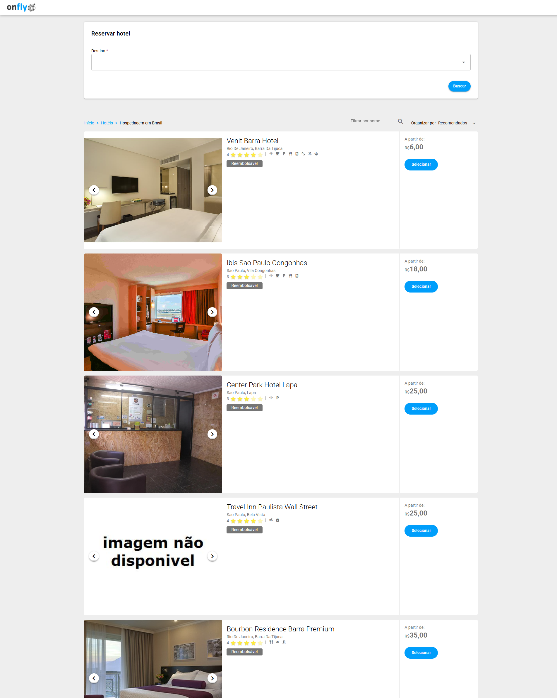
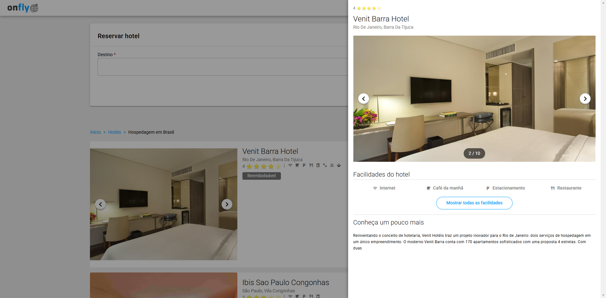

# onFly - SPA

Essa SPA tem como finalidade, listar hoteis em diferentes destinos e listar também informações sobre o mesmo.

## Features
- Filtrar hoteis por destino e nome
- Filtro de destinos com autocomplete
- Scroll infinito listando hoteis a medida que o usuario usa o scroll
- Ordenação por recomendados e melhor avaliados
- Drawer de detalhes dos hotéis
- Uso de typescript, classes para os dados

## Iniciando o projeto
1. Instalando dependencias: `npm install`
2. Rodando o servidor de desenvolvimento: `npm run dev`

## Tecnologias utilizadas
- Typescript
- Quasar
